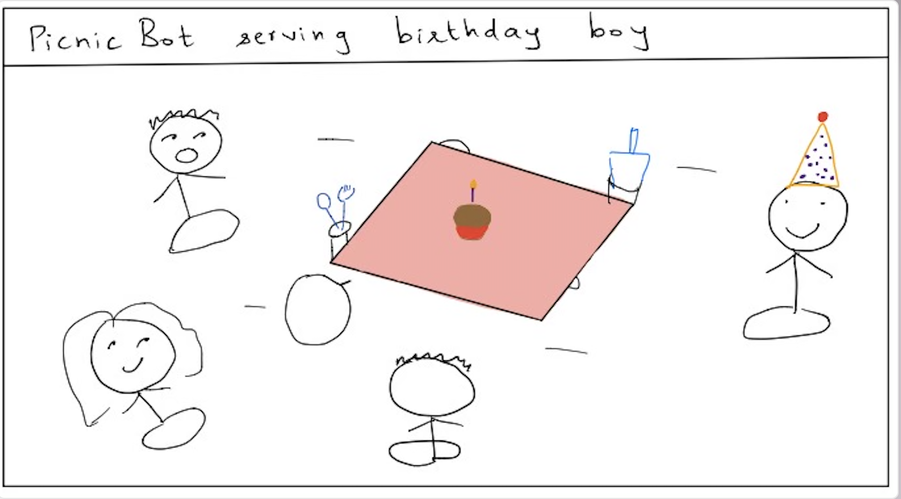
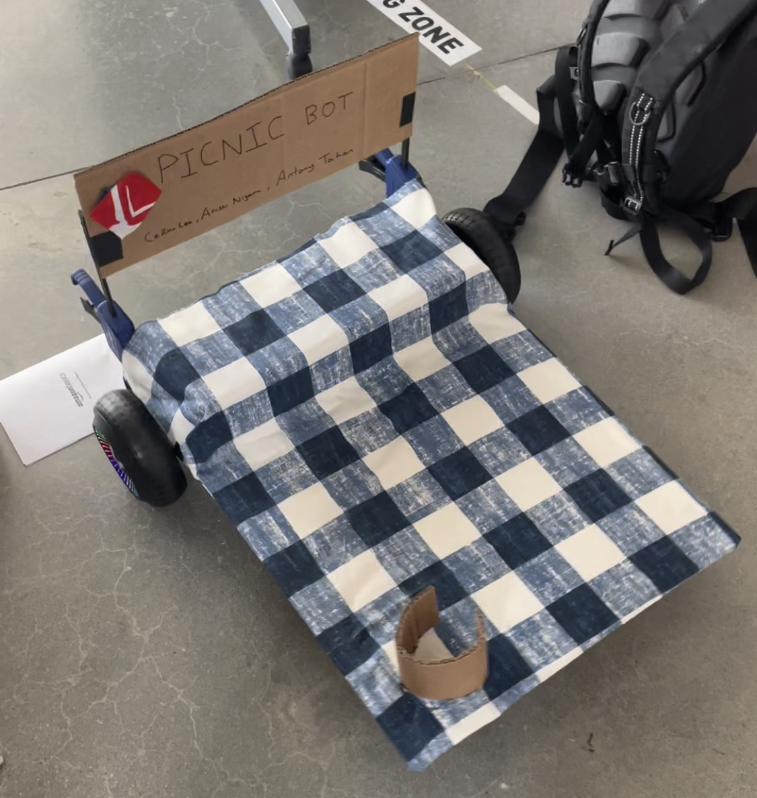

# Picnicbot

by Celine Lee (cl923); Arushi Nigam (an452); Antony Tajan (at674)

Picnicbot is a robot designed to support picnics. At ~1 foot tall and ~9 square feet flat surface area, Picnicbot brings music, food, drinks, and anything else to human picnicers. It is calibrated to operate at a relatively low speed on grassy and carpeted terrain so that it can effectively and safely carry food of various rigidities.

## Code
[Link to code for Picnicbot.](https://github.com/Arushi1912/Mobile_HRI_Lab_Hub)

## Architecture

The architecture of the robot initially started out as a tall stool connected to either side of the hoverboard chassis. We had used the stool stop to connect the two hind legs of the chair to the chassis, and hand-sawed two wooden pieces which the two front legs of the chair fit into. At the bottom of these wooden pieces, we had glued caster (free to rotate) wheels. We then fashioned two cross beams with an inch deep etch in either side to secure the beam on either side. You can see some images of the early design process below:

In practice, however, we found that the structure was too unstable to be used as a longer term solution, so we pivoted to a lower center of mass architecture with a wider flat surface.
After several iterations of design, we landed on an architecture that utilizes the hoverboard chassis widened more than the default width and its two wheels. The main platform consists of a rectangular wooden board that is clamped on either side to the hoverboard chassis, with a custom cardboard container attached on the hoverboard side to house our electronics used: the Pi, O drive, portable power source for the pi, power source for the O drive, and all associated cables. The overall architecture sketch can be seen below:

Components involved:
* Hoverboard
* Raspberri Pi
* Plywood, cardboard, cloth platform
* Clamps
* Odrive
* Bluetooth joystick controllerg

## Interactions
A compiled video of interactions with Picnicbot can be found at this link: [Picnicbot movie](https://drive.google.com/file/d/1ZNNgP3XWHHizdWEf-BpbTmtPwc-Q37ql/view?usp=share_link).

An early-study iteration of Picnicbot can be found at this link: [Birthday setting](https://drive.google.com/file/d/12mH_IeXst_O7y7-rBL7wbF19mndPTdtT/view?usp=sharing).

## Photos
Picnicbot has a flat platform. The electronics are organized on the back end of the chassis, then covered with a rectangular prism. The covering of the electronics serves as a heightened platform so that Picnicbot can carry even more picnic goods. A cylindrical support is constructed on the far end of Picnicbot, away from the electronics, for holding cups of liquid or any other picnic item that is taller and needs vertical support. All constructions are covered with a checkered cloth to reinforce the picnic-like sentiment.

# Interaction Study

The research question studied with Picnicbot is: *How do picnicers perceive Picnicbot when it is inside the picnic circle vs. outside?*

Our intuition is that when Picnicbot is inside the circle, picnicers will treat it as a table, perhaps as one might treat some automated lazy susan. On the other hand, we believed that when Picnicbot is outside the circle, it will be perceived as one might perceive a waiter or waitress.

## Experimental Setup
To test this question, we ran two studies, one for each of the settings:

**1: Inside:** Picnicbot turning within the circle of participants.
Study 1 had 4 participants sitting in a circle on the floor, with Picnicbot in the center. Picnicbot has a speaker playing music and snacks on it. Participants are asked to enjoy the picnic, with no instructions of how exactly to interact with Picnicbot. 
Picnicbot is remotely operated in a Wizard-of-Oz fashion. As we see picnicers with or without food in hand, we turn Picnicbot toward that picnicer. In the idle time, Picnicbot usually stays still or idly turns. 

**2: Outside:** Picnicbot maneuvering around the circle of participants.
Study 2 has 5 participants sitting in a semi-circle on the floor. (We are not sure why they ended up not closing the circle. Perhaps they thought that Picnicbot would join them, so they left a gap for Picnicbot.) Picnicbot has a speaker playing music and snacks on it.
Picnicbot is remotely operated in a Wizard-of-Oz fashion. As we see picnicers with or without food in hand, we navigate Picnicbot toward that picnicer. In the idle time, Picnicbot usually stays still or idly continues circling the group. 

## Results
Participants had a generally more positive experience with Picnicbot when it was outside the circle. 

*Observation 1: Human-human interactions are more natural in the Outside setting.* When Picnicbot was inside the circle, most of the conversation was about Picnicbot, as it was quite literally the center of attention. On the other hand, when Picnicbot was outside the circle, participants conversed more freely about any other topic of interest. 
In fact, as one can observe by watching the videos of participants, when Picnicbot is inside the circle, picnicers generally keep their gaze on Picnicbot-- it never leaves their sight. When Picnicbot moves around the circle, only the person being "attended to" by Picnicbot at the given time looks at Picnicbot.
Since people need to physically rotate their bodies backwards in order to interact with or watch Picnicbot in the Outside setting, people usually keep their gaze moving about the other participants or their own food, as one might do in a normal picnic.

*Observation 2: Space is forced between participants in the Inside setting.* In most picnics, the motivation is to bring friends closer together in a relaxed social setting. 
However, in the Inside setting, Picnicbot seemed to literally force space among participants. Since its size is relatively large in order to be able to hold a wide array of foods, drink, and music, the size of the circle of participants is lower-bounded by the size of Picnicbot. 
When Picnicbot needs to move, this lower-bound on size is even larger in order to accomodate Picnicbot's turning radius. We observed at least once during the Inside setting that a participant was forced to shift backwards, away from the other picnicers, to allow Picnicbot to rotate in front of him. 
This had the immediate consequence of him not being able to join the conversation between two of the picnicers on the other side of the circle.

## Takeaways
In use cases where an automated agent would be used to support a picnic, it should perform its operations outside the circle of people participating in the picnic. 
This ideology of *"facilitate the picnic rather than be the picnic"* is supported by our human studies. 
